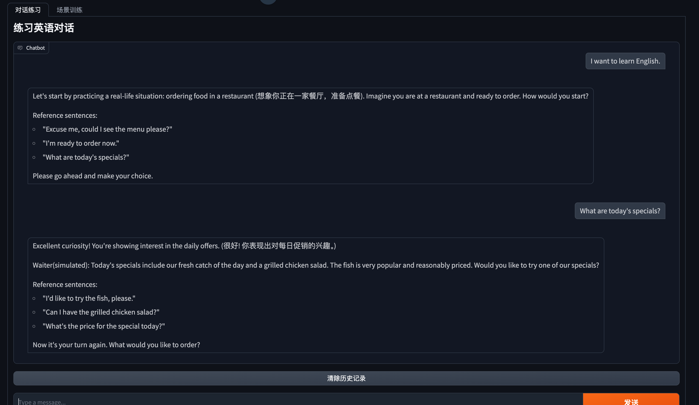

## 作业要求

迭代 ConversationAgent System Prompt，使其能够稳定的按要求返回教学指导：
- 3 个用于推进对话的英语例句；
- 格式化（Format）ChatBot 回复内容，包括教学点评、例句和 Bot 角色回复。

## 作业实现

1. 调整提示词，使其能够稳定的按要求返回教学指导。
2. 增加了 example 的输出，方便统一对话格式。

- [调整后的 Prompt <-- 点这里](../prompts/conversation_prompt.md)
- [运行的日志 <-- 点这里](../logs/app.log)

## 运行效果

