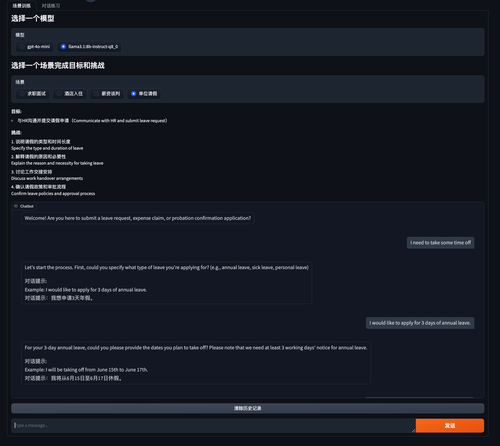

# 作业要求

1. 学习《场景化 System Prompt 设计》中与 ChatGPT 4o 的聊天记录，设计并实现 2 个新场景。
关于场景选择的说明：
- 场景 1：薪酬谈判或租房；
- 场景 2：自定义一个日常的生活或工作场景，如：单位请假、机场托运。

2. （可选）在 v0.3 基础上新增配置管理功能，支持配置不同的大模型来驱动 LanguageMentor。

## 提交要求

### 作业 1

#### 薪酬谈判场景

- [薪酬谈判场景提示词跳转 <-- 点这里](../prompts/salary_negotiation_prompt.txt)
- [薪资谈判场景开场白配置跳转 <-- 点这里](../content/intro/salary_negotiation.json)
- [薪资谈判场景对话提示配置跳转 <-- 点这里](../content/page/salary_negotiation.md)

#### 单位请假场景

- [单位请假场景提示词跳转 <-- 点这里](../prompts/leave_request_prompt.txt)
- [单位请假场景开场白配置跳转 <-- 点这里](../content/intro/leave_request.json)
- [单位请假场景对话提示配置跳转 <-- 点这里](../content/page/leave_request.md)

### 作业 2

#### 配置管理功能

- [模型配置功能代码跳转 <-- 点这里](../src/utils/llm_loader.py)
- [agent 代码改造跳转 <-- 点这里](../src/agents/scenario_agent.py#L13)
- [配置文件跳转 <-- 点这里](../llm.yaml)

